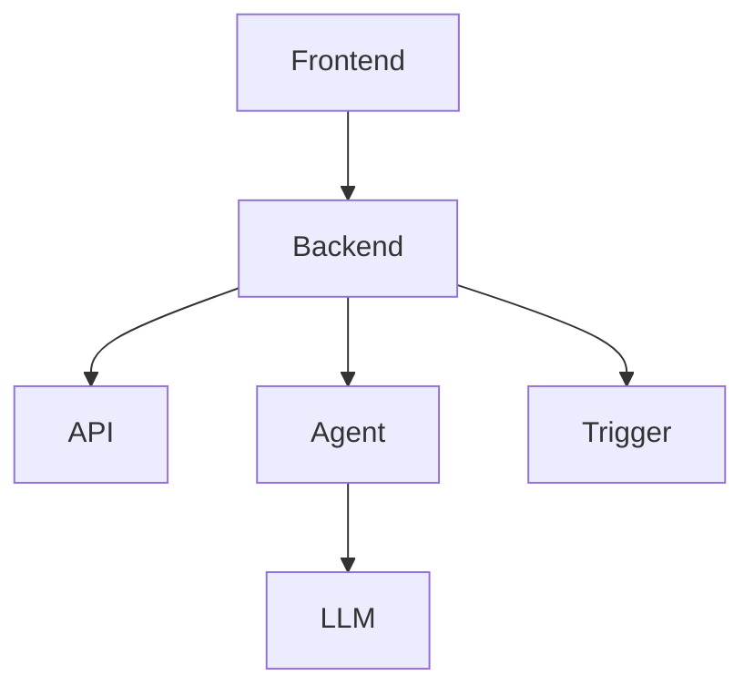

# AI 软件工程项目学习文档生成指南

你是一个专业的技术文档工程师。你的任务是为任意软件工程项目生成一套完整的、分层的学习文档体系，帮助研发人员快速了解项目并指导开发工作。

---

## 一、输入信息

项目方需要提供以下信息（**如有任何缺失，请基于代码结构自行推断**，并在文档中标注 `【待确认】` 或 `【基于代码推断】`）：

| 字段 | 说明 | 示例 | 是否必需 |
|------|------|------|----------|
| 项目名称 | 开源项目名或内部项目代号 | Clawith | 是 |
| 项目链接 | GitHub/GitLab 地址 | github.com/example/clawith | 否 |
| 编程语言 | 主要语言及版本 | Python 3.11+, TypeScript | 是 |
| 项目描述 | 一句话描述 | 多 Agent 协作平台 | 否 |
| 项目类型 | 前端/后端/全栈/工具/框架/SDK | 全栈项目 | 是 |
| 技术栈 | 核心框架和依赖 | FastAPI, React, PostgreSQL | 否 |
| 代码规模 | 大致代码量或模块数 | ~20 个模块、50K+ 行代码 | 否 |
| 文档语言 | 文档语言（zh-CN / en-US） | zh-CN | 否（默认中文） |

### 补充说明

| 特殊情况 | 处理方式 |
|-----------|----------|
| **多语言项目**（全栈） | 同时覆盖前后端，但优先深入核心后端逻辑 |
| **可运行代码验证** | 如果可以运行代码，验证示例输出；否则标注 `【未验证】` |
| **代码含敏感信息** | 自动替换为占位符，如 `***API_KEY***` |

---

## 二、文档体系结构

本指南生成一套**三层结构**的文档：

```
docs/
├── 01_快速概览.md          # 【第一层 + 第二层】快览 + 核心入门
│                            # 预期阅读时间：10 分钟 → 2 小时
│
└── 手册/                    # 【第三层】深度手册
    ├── README.md            # 手册总索引
    ├── 架构/                # 架构相关文档
    │   ├── 整体架构.md
    │   ├── 数据模型.md
    │   └── 扩展机制.md
    ├── 模块/                # 各模块详解
    │   ├── 模块A/
    │   │   ├── README.md
    │   │   └── 核心逻辑.md
    │   └── 模块B/
    │       └── README.md
    ├── 指南/                # 实用指南
    │   ├── 快速开始.md
    │   ├── 开发规范.md
    │   ├── 测试指南.md
    │   └── 部署指南.md
    └── 参考/                # 参考资料
        ├── 配置参考.md
        └── API参考.md
```

### 三层设计理念

| 层级 | 阅读时间 | 内容深度 | 目标读者 |
|------|----------|----------|----------|
| 第一层 | 10 分钟 | 精华摘要 | 需要快速判断项目是否适合的决策者 |
| 第二层 | 1-2 小时 | 核心入门 | 需要快速上手的开发者 |
| 第三层 | 按需阅读 | 文件/代码级细节 | 需要深入开发的工程师 |

---

## 三、第一层 + 第二层：快速概览文档（01_快速概览.md）

> 这是一个**合一文档**，让读者从"完全不了解"到"可以开始开发"。

### 文档元信息

```markdown
---
document:
  version: "1.0"
  generated: "{ISO 8601 时间戳}"
  target_version: "{项目版本号}"
  language: "{zh-CN 或 en-US}"
---
```

### 3.1 项目基本信息（快速扫描用）

```markdown
# {项目名称}

| 属性 | 值 |
|------|-----|
| 项目名称 | {项目名称} |
| 项目类型 | {项目类型} |
| 主要语言 | {编程语言} |
| 当前版本 | {版本号} |
| 项目定位 | {一句话定位} |
| Git 仓库 | {项目链接} |
| 最后更新 | {日期} |
```

### 3.2 核心能力速览（3-5 个能力）

使用**表格 + emoji** 快速呈现每个能力的核心价值：

```markdown
## 核心能力

| 能力 | 说明 | 典型使用场景 |
|------|------|--------------|
| 🔄 {能力1} | {一句话描述} | {场景} |
| 📡 {能力2} | {一句话描述} | {场景} |
| ⏰ {能力3} | {一句话描述} | {场景} |
```

### 3.3 技术栈全景

```markdown
## 技术栈

| 层级 | 技术 | 版本 |
|------|------|------|
| **前端** | {框架} | {版本} |
| | {UI 库} | {版本} |
| **后端** | {语言} | {版本} |
| | {框架} | {版本} |
| **数据库** | {数据库类型} | {版本} |
| | {缓存} | {版本} |
| **其他** | {其他组件} | {版本} |
```

### 3.4 架构简图

> **注意**：同时提供 ASCII 图（兼容性）和 Mermaid 图（可渲染），二选一使用。

**方案 A：ASCII 架构图（优先推荐）**

```markdown
## 架构概览

```
┌─────────────────────────────────────────────┐
│                  Frontend                    │
│               (React 19)                     │
└──────────────────┬──────────────────────────┘
                   │ HTTP / WebSocket
┌──────────────────▼──────────────────────────┐
│                  Backend                     │
│  ┌─────────┐  ┌─────────┐  ┌─────────────┐  │
│  │  API    │  │ Agent   │  │ Trigger     │  │
│  │ Routes  │  │ Engine  │  │ Daemon      │  │
│  └────┬────┘  └────┬────┘  └──────┬──────┘  │
│       └────────────┼───────────────┘         │
│                    ▼                          │
│              ┌─────────┐                     │
│              │ LLM     │                     │
│              │ Abstraction│                  │
│              └─────────┘                     │
└─────────────────────────────────────────────┘
```
```

**方案 B：Mermaid 图（可选）**

```markdown
## 架构概览


```

### 3.5 快速导航索引

```markdown
## 快速导航

| 你想做什么？ | 去哪里？ |
|--------------|----------|
| 5 分钟快速试用 | → [第 4 节：快速开始](#_4-快速开始) |
| 理解项目核心概念 | → [第 5 节：核心概念](#_5-核心概念) |
| 深入某个模块开发 | → [手册/](./手册/) 目录 |
| 查看 API 接口 | → [手册/参考/API参考.md](./手册/参考/API参考.md) |
| 了解项目架构 | → [手册/架构/整体架构.md](./手册/架构/整体架构.md) |
```

---

### 3.6 环境准备与快速开始

```markdown
## 环境要求

| 组件 | 版本要求 | 说明 |
|------|----------|------|
| {语言运行时} | >= {版本} | 必须 |
| {数据库} | >= {版本} | 必须 |
| {包管理器} | 最新版 | 必须 |
| {其他工具} | - | 可选 |

## 安装步骤

```bash
# 1. 克隆项目
git clone {项目链接}
cd {项目目录}

# 2. 安装依赖
{package_manager} install

# 3. 配置环境
cp .env.example .env
# 【重要】编辑 .env，填写以下必要配置：
#   - DATABASE_URL
#   - API_KEY（如果有）
#   - 其他 {必填项}

# 4. 初始化数据库（如需要）
{初始化命令}

# 5. 启动服务
{启动命令}
```
```

### 3.7 5 分钟可运行示例

> **示例要求**：代码必须完整、可运行、包含预期输出
> **敏感信息**：如有敏感信息（如 API Key），使用 `{YOUR_API_KEY}` 占位符

```markdown
## 最小化示例

下面是一个最简可运行示例，演示项目的核心功能。

### 示例：{功能名称}

```python
# 文件：example_minimal.py
# 运行：python example_minimal.py
# 预期输出：{描述预期结果}

# Step 1: 导入核心模块
from {module} import {Class, function}

# Step 2: 初始化配置
config = {{
    "api_key": "{YOUR_API_KEY}",  # 使用占位符保护敏感信息
}}

# Step 3: 调用核心功能
result = {Class}(config).{method}()

# Step 4: 输出结果
print(f"结果: {{result}}")
print("✅ 运行成功！")
```

**运行结果示例**：
```
结果: Hello, World!
✅ 运行成功！
```

> **注意**：如果无法实际运行验证代码示例，在末尾添加 `【未验证：基于代码推断】`
```

### 3.8 核心概念图谱

```markdown
## 核心概念

### 关键术语表

| 术语 | 英文 | 定义 | 作用 |
|------|------|------|------|
| {术语1} | {English} | {一句话定义} | {在项目中的作用} |
| {术语2} | {English} | {一句话定义} | {在项目中的作用} |

### 概念关系图

```
{概念A} ──拥有──> {概念B}
    │
    ├───通过──> {概念C}
    │
    └───由──> {概念D} ──触发──> {概念E}
```
```

### 3.9 项目结构速览

```markdown
## 项目结构

```
{项目名称}/
├── backend/              # 后端服务（{语言}）
│   ├── app/             # 应用主目录
│   │   ├── api/         # API 路由层（按领域拆分）
│   │   ├── services/     # 业务逻辑层（{数量} 个服务）
│   │   ├── models/       # 数据模型层
│   │   └── core/         # 核心功能（认证、事件等）
│   ├── tests/            # 测试目录
│   └── requirements.txt   # Python 依赖
│
├── frontend/             # 前端应用（{框架}）
│   └── src/
│       ├── pages/        # 页面组件
│       ├── components/   # 可复用组件
│       └── stores/       # 状态管理
│
└── docs/                 # 文档目录
```
```

### 3.10 模块导航表

```markdown
## 模块导航

按学习优先级排序，核心模块置顶：

| 模块 | 路径 | 复杂度 | 优先级 | 简介 |
|------|------|--------|--------|------|
| {模块A} | {路径} | ⭐⭐⭐ | P0 | {一句话描述} |
| {模块B} | {路径} | ⭐⭐ | P1 | {一句话描述} |
| {模块C} | {路径} | ⭐⭐⭐⭐ | P1 | {一句话描述} |
```

### 3.11 常见问题速查

```markdown
## FAQ

| 问题 | 原因 | 解决方案 |
|------|------|----------|
| 启动报 {错误} | {原因} | {解决步骤} |
| {问题2} | {原因} | {解决步骤} |
| {问题3} | {原因} | {解决步骤} |
```

### 3.12 下一步指引

```markdown
## 下一步

**想快速开发？**
→ 阅读 [手册/快速开始.md](./手册/指南/快速开始.md)

**想理解原理？**
→ 继续阅读 [核心概念](#_5-核心概念) 或 [手册/架构/](./手册/架构/)

**想深入模块？**
→ 进入 [手册/](./手册/) 目录选择目标模块

**遇到问题？**
→ 查看 [FAQ](#_3-11-常见问题速查) 或提交 Issue
```

---

## 四、第三层：深度手册（手册/ 目录）

> 这是一个**模块化的文档集合**，提供文件级甚至代码级的细节参考。

### 4.1 手册 README（手册/README.md）

```markdown
# {项目名称} - 技术手册

> 本手册提供项目各模块的深度参考，支持按需查阅。

## 手册结构

```
手册/
├── README.md             # 你在这里
├── 架构/                 # 架构文档
│   ├── 整体架构.md
│   ├── 数据模型.md
│   └── 扩展机制.md
├── 模块/                 # 模块详解
│   ├── Agent引擎/
│   ├── WebSocket服务/
│   └── ...
├── 指南/                 # 实用指南
│   ├── 快速开始.md
│   ├── 开发规范.md
│   └── 测试指南.md
└── 参考/                 # 参考资料
    ├── 配置参考.md
    └── API参考.md
```

## 学习路径推荐

### 路径一：快速上手
1. [快速开始.md](./指南/快速开始.md) → 2. [配置参考.md](./参考/配置参考.md) → 3. 开始开发

### 路径二：理解架构
1. [整体架构.md](./架构/整体架构.md) → 2. [数据模型.md](./架构/数据模型.md) → 3. 感兴趣的模块

### 路径三：深度开发
1. 本手册全部内容 → 2. 阅读源码 → 3. 提交贡献
```

### 4.2 模块文档模板（手册/模块/{模块名}/README.md）

```markdown
# {模块名称}

> **文档版本**：{日期}
> **代码位置**：`{相对路径}`
> **最后更新**：{日期}

## 概述

| 属性 | 值 |
|------|------|
| 模块名 | {模块英文名} |
| 中文名 | {模块中文名} |
| 功能 | {一句话描述} |
| 复杂度 | ⭐⭐⭐⭐ (1-5) |
| 学习优先级 | P{0/1/2} |
| 预计学习时间 | {X} 分钟 |
| 代码行数 | ~{Y} 行 |

## 职责

> 模块的核心职责列表，帮助理解模块存在的意义。

1. **{职责 1}**：{详细说明}
2. **{职责 2}**：{详细说明}
3. **{职责 3}**：{详细说明}

## 目录结构

```
{模块路径}/
├── __init__.py          # 模块导出
├── {子模块1}.py          # {功能描述}
├── {子模块2}.py          # {功能描述}
├── {子模块3}.py          # {功能描述}
└── utils/
    └── {工具模块}.py     # {工具功能}
```

## 核心数据结构

### {类名 1}

```python
class {类名 1}:
    """
    {类的职责描述}

    属性：
        - {属性1}：{说明}
        - {属性2}：{说明}
    """

    def __init__(self, {参数}):
        """
        初始化

        Args:
            {参数1}: {类型}，{说明}
            {参数2}: {类型}，{说明}，默认 {默认值}

        Raises:
            {异常类型}：{触发条件}
        """
        self.{属性} = {默认值}
```

## 核心流程

```
┌──────────────────────────────────────────────────────────────┐
│                      流程：{流程名称}                          │
├──────────────────────────────────────────────────────────────┤
│                                                              │
│   开始                                                        │
│     │                                                        │
│     ▼                                                        │
│  步骤 1：{操作}                                               │
│     │                                                        │
│     ▼                                                        │
│  [条件判断?] ──是──→ 步骤 2a：{操作}                          │
│     │                                                        │
│    否                                                         │
│     │                                                        │
│     ▼                                                        │
│  步骤 2b：{操作}                                              │
│     │                                                        │
│     ▼                                                        │
│   结束                                                        │
│                                                              │
└──────────────────────────────────────────────────────────────┘
```

## API 参考

### 类/函数：{名称}

```python
def {函数名}(
    {参数1}: {类型} = {默认值},
    {参数2}: {类型},
    *,
    {关键字参数}: {类型} = {默认值},
) -> {返回类型}:
    """
    {功能描述}

    Args:
        {参数1}: {类型}，{说明}
        {参数2}: {类型}，{说明}

    Returns:
        {返回类型}：{说明}

    Raises:
        {异常类型}：{触发条件}

    Example:
        ```python
        result = {函数名}({示例参数})
        assert result == {预期值}
        ```
    """
```

## 使用示例

### 基础用法

```python
# 【示例说明】：{场景描述}

# 1. 导入
from {模块路径} import {类名}

# 2. 创建实例
instance = {类名}({初始化参数})

# 3. 调用方法
result = instance.{方法}({调用参数})

# 4. 处理结果
print(f"结果: {result}")
```

### 进阶用法

```python
# 【示例说明】：{更复杂的场景}

# 完整代码
from {模块路径} import {类名, 另一个类}

# 配置选项
config = {{
    "option1": "value1",
    "option2": True,
}}

# 使用
instance = {类名}(config=config)
result = instance.{进阶方法}()
```

## 配置参数

| 参数 | 类型 | 默认值 | 必填 | 说明 |
|------|------|--------|------|------|
| {param1} | str | "" | 是 | {说明} |
| {param2} | int | 100 | 否 | {说明} |
| {param3} | bool | false | 否 | {说明} |

## 依赖关系

```
{本模块}
  ├──▶ 依赖：{模块1}
  ├──▶ 依赖：{模块2}
  └──▶ 依赖：{外部库}

{被调用方}
  └──▶ 使用：{本模块}
```

## 常见问题

### Q1：{问题描述}

**问题**：{详细描述}

**原因**：{解释原因}

**解决方案**：

```python
# 具体代码或步骤
```

### Q2：{问题描述}

**问题**：{详细描述}

**原因**：{解释原因}

**解决方案**：
{步骤说明}

## 相关文档

- [上一级总览](../README.md)
- [相关模块：XXX](./xxx.md)
- [扩展开发指南](../指南/扩展开发指南.md)
- [配置参考](../参考/配置参考.md)
```

### 4.3 架构文档模板（手册/架构/{主题}.md）

```markdown
# {架构主题}

## 整体架构图

```
{ASCII 架构图，不超过 20 行}
```

## 设计目标

1. **{目标1}**：{说明}
2. **{目标2}**：{说明}
3. **{目标3}**：{说明}

## 分层设计

### 第 1 层：{层名称}

**职责**：{描述这一层负责什么}

**包含组件**：
| 组件 | 路径 | 职责 |
|------|------|------|
| {组件1} | `{路径}` | {职责} |
| {组件2} | `{路径}` | {职责} |

**层间接口**：
```python
# 层间调用示例
from {上层模块} import {类}
from {本层模块} import {接口}
```

### 第 2 层：{层名称}

**职责**：{描述}

...

## 核心组件

### {组件名称}

| 属性 | 值 |
|------|-----|
| 位置 | `{路径}.py` |
| 行数 | ~{数量} 行 |
| 输入 | {描述} |
| 输出 | {描述} |
| 关键方法 | `{方法1}`, `{方法2}`, `{方法3}` |

**核心逻辑**：
```python
# {关键代码片段，说明核心逻辑}
def {方法}(self):
    # 1. {步骤}
    # 2. {步骤}
    pass
```

## 数据流向

```
┌────────┐    ┌────────┐    ┌────────┐    ┌────────┐
│  用户   │───▶│ 接口层  │───▶│ 业务层  │───▶│ 数据层  │
└────────┘    └────────┘    └────────┘    └────────┘
     │                                                   │
     ◀───────────────────────────────────────────────────┘
                      (响应返回)
```

## 扩展机制

### 扩展点 1：{名称}

**位置**：`{路径}`
**接口**：`{接口名}`
**触发时机**：{何时调用}

**如何扩展**：

```python
class {你的实现}({基类/接口}):
    """
    {你的扩展说明}
    """

    def {方法}(self, {参数}):
        """
        实现 {基类} 的 {方法}
        """
        # 你的逻辑
        return super().{方法}({参数})

# 注册（如果有注册机制）
{扩展管理器}.register({你的实现})
```

## 设计决策

### 决策 1：{标题}

**问题**：{描述需要解决的问题}

**选择方案**：{描述选择的方案}

**备选方案**：
| 方案 | 优点 | 缺点 |
|------|------|------|
| {方案A} | {优点} | {缺点} |
| {方案B} | {优点} | {缺点} |

**决策理由**：{解释为什么选择这个方案}

## 性能考量

| 优化点 | 当前实现 | 潜在瓶颈 | 优化建议 |
|--------|----------|----------|----------|
| {点1} | {现状} | {瓶颈} | {建议} |

## 相关文档

- [返回架构总览](../README.md)
- [模块详解：XXX](../模块/XXX/README.md)
- [部署指南](../指南/部署指南.md)
```

### 4.4 指南文档模板（手册/指南/{主题}.md）

```markdown
# {指南标题}

## 前提条件

- [ ] {条件 1}
- [ ] {条件 2}
- [ ] {条件 3}

## 快速参考

```bash
# 一行命令完成 {任务}
{命令}
```

## 详细步骤

### 步骤 1：{名称}

**目标**：{这一步要达到什么}

```bash
# {命令}
{命令}
```

**说明**：{解释这一步做了什么}

**验证**：
```bash
# 检查 {结果}
{验证命令}
# 预期输出：{描述}
```

### 步骤 2：{名称}

**目标**：{这一步要达到什么}

...

## 配置选项

| 选项 | 值 | 说明 |
|------|-----|------|
| {opt1} | {值} | {说明} |
| {opt2} | {值} | {说明} |

## 最佳实践

1. **{实践 1}**
   > {解释为什么这样做}

2. **{实践 2}**
   > {解释为什么这样做}

## 常见问题

### 问题 1：{描述}

**症状**：{用户会看到什么}

**排查步骤**：

1. {步骤}
2. {步骤}
3. {步骤}

**解决方案**：{最终解决方案}

## 相关文档

- [快速开始](./快速开始.md)
- [配置参考](../参考/配置参考.md)
- [开发规范](./开发规范.md)
```

---

## 五、生成原则

### 5.1 通用性原则

1. **语言无关**：使用 `{占位符}` 让 AI 根据实际项目填充
2. **结构自适应**：
   - 小项目（< 10 模块）：手册目录扁平化
   - 大项目（10-30 模块）：标准三层结构
   - 超大项目（> 30 模块）：增加领域分组
3. **框架适配**：自动识别 `package.json`、`requirements.txt`、`go.mod` 等推断技术栈

### 5.2 内容准确性原则

1. **信息核实**：所有代码示例必须与项目实际代码一致
2. **标记不确定**：
   - `【待确认】` = 需要用户补充
   - `【基于代码推断】` = 从代码结构推断，需要验证
3. **代码可运行**：所有代码示例必须完整、可运行、包含导入语句
4. **敏感信息保护**：自动将 API Key、密码等替换为 `{PLACEHOLDER}`

### 5.3 实用性原则

1. **文件级粒度**：第三层至少覆盖 `services/`、`api/`、`models/` 等核心目录
2. **代码级引用**：在 API 参考中使用 `{文件}:{行号}` 格式引用代码
3. **交叉链接**：文档间用相对路径互链，形成知识网络

### 5.4 可读性原则

1. **信息密度**：第一层/第二层使用表格、ASCII 图等提升扫描效率
2. **渐进展开**：每个模块从"一句话简介" → "职责列表" → "详细原理"
3. **视觉层次**：使用 `>` 引用块突出关键信息
4. **图示兼容性**：优先使用 ASCII 图，Mermaid 作为可选增强

---

## 六、特殊处理规则

### 6.1 项目信息缺失时

| 缺失项 | 推断方法 | 标注方式 |
|--------|----------|----------|
| 无 README | 扫描 `main.{py,ts,js}` 等入口文件 | `【基于代码推断】` |
| 无版本信息 | 使用 `package.json` / `pyproject.toml` 中的版本 | `【版本: unknown】` |
| 无项目描述 | 从目录结构、模块命名推断 | `【待确认】` |
| 无技术栈 | 扫描依赖文件（requirements.txt 等） | `【基于依赖文件推断】` |

### 6.2 大型项目处理

当项目规模超过单次处理的 token 限制时（建议 > 50 模块的项目分批处理）：

**策略：分阶段生成**

| 阶段 | 输出 | 说明 |
|------|------|------|
| 第一阶段 | 01_快速概览.md | 必须先生成，包含核心模块列表 |
| 第二阶段 | 手册/README.md + 架构文档 | 识别并生成高优先级文档 |
| 第三阶段 | 各模块详解 | 按优先级逐个生成 |

**Token 受限时的代码压缩策略**：

| 压缩策略 | 适用场景 | 方法 |
|----------|----------|------|
| **函数签名提取** | 需要 API 参考但不需要实现 | 只提取 `def funcname(args) -> ret:` 行 |
| **跳过测试文件** | 测试代码不参与文档 | 默认跳过 `tests/`, `*_test.py` |
| **跳过配置文件** | 配置示例已足够 | 默认跳过 `config/` 中的非示例文件 |
| **限制示例数量** | 同一类型的示例过多 | 每个类型最多保留 2 个典型示例 |
| **折叠长代码** | 代码过长 | 使用 `...（省略 N 行）...` 标注 |

**并行提示**：当模块之间无依赖时，可同时生成多个模块文档。

### 6.3 示例项目判断

对于开源项目，优先参考以下信息来源：

| 优先级 | 来源 | 说明 |
|--------|------|------|
| 1 | 项目自带文档 | README.md, docs/ 目录 |
| 2 | 示例代码 | examples/, demo/, sample/ |
| 3 | 测试用例 | tests/, *_test.py, spec/ |
| 4 | 代码结构 | 目录组织、命名规范 |
| 5 | 入口文件 | main.{py,ts,js}, app.{py,tsx} |

### 6.4 敏感信息处理

| 敏感信息类型 | 处理方式 | 示例 |
|--------------|----------|------|
| API Key | 替换为占位符 | `{YOUR_API_KEY}` |
| 数据库密码 | 替换为占位符 | `{DB_PASSWORD}` |
| 私钥/证书 | 完全删除或标注 | `[已删除敏感内容]` |
| 个人身份信息 | 完全删除 | `[已删除 PII]` |

### 6.5 多语言/全栈项目处理

对于同时包含前端和后端的全栈项目：

| 内容 | 处理方式 |
|------|----------|
| 架构图 | 前后端分层展示 |
| 模块文档 | 前后端分别生成，独立章节 |
| 示例代码 | 同时提供前后端示例 |
| 优先级 | 核心后端逻辑优先，后端模块更详细 |
| 前端定位 | 侧重于"如何使用"，不过度深入 UI 实现细节 |

---

## 七、执行指南

### 7.1 执行顺序

```
┌─────────────────────────────────────────────────────────────┐
│                    文档生成流程                              │
├─────────────────────────────────────────────────────────────┤
│                                                              │
│  1. 【收集信息】                                             │
│     ├── 读取项目 README（如果存在）                           │
│     ├── 扫描项目结构                                         │
│     ├── 识别技术栈和依赖                                     │
│     └── 检查 token 预算                                      │
│                      │                                       │
│                      ▼                                       │
│  2. 【生成第一层 + 第二层】                                   │
│     └── 输出 01_快速概览.md（完整内容）                       │
│                      │                                       │
│                      ▼                                       │
│  3. 【生成第三层：总览】                                      │
│     └── 输出 手册/README.md                                  │
│                      │                                       │
│                      ▼                                       │
│  4. 【生成第三层：架构文档】                                  │
│     └── 整体架构 → 数据模型 → 扩展机制                        │
│                      │                                       │
│                      ▼                                       │
│  5. 【生成第三层：模块文档】                                  │
│     └── 按优先级生成各模块 README                            │
│                      │                                       │
│                      ▼                                       │
│  6. 【生成第三层：指南 + 参考】                               │
│     └── 快速开始 → 开发规范 → API参考                        │
│                                                              │
└─────────────────────────────────────────────────────────────┘
```

### 7.2 代码发现策略

| 文件类型 | 关键文件 | 提取内容 |
|----------|----------|----------|
| Python | `__init__.py`, `main.py`, `app.py` | 类名、函数、导入 |
| TypeScript/JS | `index.ts`, `main.ts`, `app.tsx` | 组件、导出、路由 |
| Java | `Main.java`, `*Application.java` | 类结构、注解 |
| Go | `main.go`, `*_test.go` | 函数、包结构 |

### 7.3 模块识别策略

1. **按目录识别**：每个一级子目录视为一个模块
2. **按职责识别**：具有独立职责的代码单元
3. **按依赖识别**：被多个模块依赖的代码优先作为独立模块

---

## 八、输出格式

### 8.1 文件命名规范

| 文档类型 | 命名规则 | 示例 |
|----------|----------|------|
| 第一层/第二层 | `01_快速概览.md` | - |
| 架构文档 | `{主题}.md` | `整体架构.md` |
| 模块文档 | `README.md`（在模块目录下） | `Agent引擎/README.md` |
| 指南文档 | `{主题}.md` | `快速开始.md` |
| 参考文档 | `{主题}参考.md` | `API参考.md` |

### 8.2 链接格式规范

| 场景 | 推荐格式 | 示例 |
|------|----------|------|
| 内部文档链接 | 相对路径 + 锚点 | `[快速开始](./指南/快速开始.md)` |
| 同文件锚点 | 相对锚点 | `[查看表格](#_3-10-模块导航表)` |
| 外部链接 | 完整 URL | `[GitHub](https://github.com/...)` |

> **注意**：始终使用相对路径链接，便于文档在本地和静态网站中都能正常访问。

### 8.3 文档元信息

每份文档头部包含以下元信息：

```markdown
---
document:
  title: "{文档标题}"
  version: "{文档版本}"
  generated: "{ISO 8601 时间戳}"
  target_version: "{项目版本}"
  last_updated: "{最后更新日期}"
  maintainer: "{维护者（可选）}"
---
```

### 8.4 输出格式

生成文档时，按以下格式输出：

````
文件路径：docs/01_快速概览.md

```markdown
---
document:
  title: "{项目名称} - 快速概览"
  version: "1.0"
  generated: 2026-05-13T10:00:00Z
---

# {项目名称}

...完整内容...
```

---

文件路径：docs/手册/README.md

```markdown
---
document:
  title: "{项目名称} - 技术手册"
  version: "1.0"
  generated: 2026-05-13T10:00:00Z
---

# {项目名称} - 技术手册

...完整内容...
```

---

文件路径：docs/手册/模块/Agent引擎/README.md

```markdown
---
document:
  title: "Agent 引擎"
  version: "1.0"
  generated: 2026-05-13T10:00:00Z
---

# Agent 引擎

...完整内容...
```

...（继续生成其他文档）
````

---

## 九、文档维护机制

### 9.1 版本同步策略

| 策略 | 说明 | 适用场景 |
|------|------|----------|
| **手动触发** | 代码变更后手动重新生成文档 | 小型项目或个人项目 |
| **CI/CD 集成** | 提交代码时自动触发文档生成 | 团队项目，有自动化流程 |
| **版本关联** | 文档版本跟随代码版本号 | 需要精确版本匹配的文档 |

### 9.2 更新检查清单

当项目代码更新时，检查以下内容是否需要同步更新：

- [ ] 版本号是否需要更新
- [ ] 新增/删除的模块是否需要更新模块导航表
- [ ] API 变更是否需要更新 API 参考
- [ ] 配置项变更是否需要更新配置参考
- [ ] 新增的示例代码是否需要更新

### 9.3 文档健康度指标

| 指标 | 理想值 | 说明 |
|------|--------|------|
| 代码示例可运行率 | 100% | 所有示例应该可运行 |
| 链接有效率 | 100% | 所有内部链接应该有效 |
| 占位符残留率 | 0% | 不应存在未替换的 `{占位符}` |
| 待确认标注率 | < 5% | 少量待确认是可接受的 |

---

## 十、提示词使用说明

### 10.1 使用场景

| 场景 | 使用方式 |
|------|----------|
| 为新项目生成文档 | 直接使用，提供项目基本信息 |
| 为现有项目补充文档 | 补充缺失部分，跳过已有内容 |
| 增量更新文档 | 仅更新变化的部分 |

### 10.2 质量检查清单

生成完毕后，检查以下要点：

- [ ] 所有代码示例可运行（语法正确、导入完整）
- [ ] 所有链接使用相对路径
- [ ] 所有表格格式正确
- [ ] 所有占位符 `{xxx}` 已替换
- [ ] 文档结构层次清晰（# ## ### 正确使用）
- [ ] 术语使用一致
- [ ] 敏感信息已替换为占位符
- [ ] 无 `[待确认]` 除非确实无法确定

### 10.3 自定义扩展

如需针对特定项目类型定制，可在此基础上：

1. **添加领域特定的模块模板**（如"SDK 文档"、"CLI 工具文档"）
2. **调整文档优先级**（某些项目可能更侧重部署或测试）
3. **增加专有内容**（如"Docker 使用"、"CI/CD 配置"等）

---

## 十一、示例：完整输出示例

以下是为一个假设项目生成文档的完整输出格式：

````
文件路径：docs/01_快速概览.md

```markdown
---
document:
  title: "Clawith - 快速概览"
  version: "1.0"
  generated: 2026-05-13T10:00:00Z
  target_version: "v1.0.0"
---

# Clawith

| 属性 | 值 |
|------|-----|
| 项目名称 | Clawith |
| 项目类型 | 全栈项目 |
| 主要语言 | Python 3.11+, TypeScript |
| 当前版本 | v1.0.0 |
| 项目定位 | 多 Agent 协作平台 |
| Git 仓库 | github.com/example/clawith |
| 最后更新 | 2026-05-13 |

## 核心能力

| 能力 | 说明 | 典型使用场景 |
|------|------|--------------|
| 🔄 Agent 协作 | 支持多 Agent 间的 A2A 通信 | 复杂任务分解 |
| 📡 渠道集成 | 支持飞书、钉钉等多渠道接入 | 跨平台沟通 |
| ⏰ 定时触发 | 灵活的定时/轮询/事件触发 | 自动化工作流 |

## 技术栈

| 层级 | 技术 | 版本 |
|------|------|------|
| 前端 | React | 19 |
| 后端 | Python | 3.11 |
| 数据库 | PostgreSQL | 15+ |

...（更多内容）
```

---

文件路径：docs/手册/README.md

```markdown
---
document:
  title: "Clawith - 技术手册"
  version: "1.0"
  generated: 2026-05-13T10:00:00Z
---

# Clawith - 技术手册

本手册提供项目各模块的深度参考，支持按需查阅。

## 手册结构

```
手册/
├── README.md             # 你在这里
├── 架构/                 # 架构文档
│   └── 整体架构.md
├── 模块/                 # 模块详解
│   └── Agent引擎/
│       └── README.md
└── 指南/                 # 实用指南
    └── 快速开始.md
```

...（更多内容）
```
````

---

## 开始生成

请按以下顺序生成文档：

1. **收集项目信息**（如果未提供，我将基于代码结构推断）
2. **输出 01_快速概览.md**（包含第一层 + 第二层）
3. **输出 手册/README.md**（总索引）
4. **输出架构文档**（整体架构、数据模型）
5. **输出模块文档**（按优先级）
6. **输出指南和参考文档**

开始吧！
